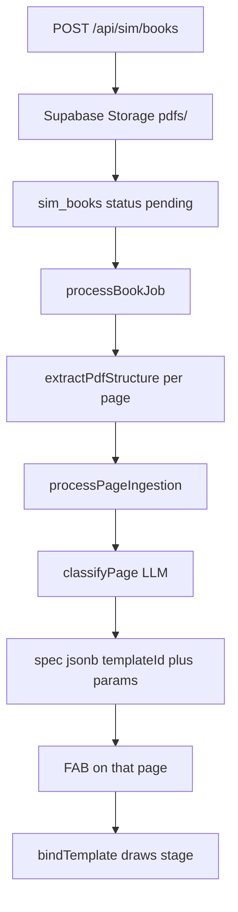

# Tomorrow: PDF → sim mapping (detailed runbook)

Work this **in order**. Do not start new sim drawings. Do not add PDF bboxes. Goal: when you upload a PDF, each relevant page gets up to 3 annotations whose JSON `spec` has the right `templateId` + textbook `params`, and the FAB on that page plays them.

**Related:** [phases.md](phases.md) (chat UI) · [simPhases.md](simPhases.md) (template catalog) · [Template_Build_Plan.md](Template_Build_Plan.md)

---

## Time box (one day)

| Block | Hours | Work |
|-------|-------|------|
| A | 1.5 | Golden quotes + matcher |
| B | 1.5 | Ingest fallback + word gate |
| C | 0.75 | Curator prompt |
| D | 1.5 | Cache + re-annotate API/UI |
| E | 1.0 | Worker progress + retry |
| F | 1.0 | Real PDF + tests |

### Checklist

- [ ] A — 18 golden matcher tests pass (`npm test --workspace=shared`)
- [ ] B — `resolvePageCandidates` + 40-word gate; LLM wins when present
- [ ] C — `simspec.v3.md` disambiguation + 6 few-shots; never emit `stage`
- [ ] D — No cross-book hash reuse; `POST /books/:id/reannotate`; BookManager button
- [ ] E — `classified_pages`; retry LLM once then continue; UI shows `12 / 40`
- [ ] F — Upload a chapter PDF; FAB `templateId` + `params` look right; tests green

---

## How it already works (do not rebuild)



| Layer | File | Job |
|-------|------|-----|
| Upload UI | `web/src/features/pdf-simulator/components/BookManager.tsx` | Multipart upload, poll status |
| Route | `server/src/routes/simulation.ts` | `POST /books` fires worker, does not await |
| Worker | `server/src/workers/annotateBook.ts` | Extract pages, call ingest sequentially |
| Ingest | `server/src/services/sim/ingest.ts` | Hash cache, word gate, LLM, triage, normalize, insert |
| LLM | `server/src/services/sim/classify.ts` + `server/src/prompts/simspec.v3.md` | JSON candidates, catalog injected |
| Matcher | `shared/templates/match.ts` | Keywords + number extract — **used by `/generate` today, not by book ingest** |
| Store | `sim_annotations.spec` jsonb | See JSON below |
| Play | `web/src/features/pdf-simulator/components/SimPanel.tsx` | `bindTemplate(templateId, spec.params)` |

### What is stored (JSON)

Each mapped sim is one row in `sim_annotations`. Simulator inputs live in the `spec` **jsonb** column (`migrations/0001_sim_books.sql`). The drawing is **not** stored.

Example after ingest (two resistors in series on 10 V):

```json
{
  "version": "2.0",
  "templateId": "series_parallel",
  "params": { "V": 10, "R1": 2, "R2": 3, "mode": 0 },
  "paramMeta": {
    "V": { "unit": "V", "source": "extracted" },
    "R1": { "unit": "Ω", "source": "extracted" },
    "R2": { "unit": "Ω", "source": "extracted" },
    "mode": { "source": "extracted" }
  },
  "title": "Series combination",
  "domain": "physics",
  "quote": "Two resistors of 2 Ω and 3 Ω are connected in series across a 10 V battery.",
  "equations": ["R_s = R_1+R_2"],
  "isSimulatable": true
}
```

| Stored | Not stored |
|--------|------------|
| `templateId` — which sim to play | `stage.elements` (the drawing) |
| `params` — textbook numbers and choice codes (`mode: 0`, `kind: 1`) | Live slider drags in the UI |
| `paramMeta.source` — extracted vs catalog default | Chat explanations |
| `quote`, title, domain, equations | The PDF file (that is Storage) |

On click, `SimPanel` loads `spec.params` into sliders/buttons, then `bindTemplate(templateId, params)` runs the sim file to draw the stage. Moving a slider only changes local React state; refresh reloads JSON. Re-annotate replaces the JSON from a new LLM/matcher pass.

### Gaps this plan fixes

- Ingest **never** calls `matchTemplateFromText`. If the LLM returns `[]` or unknown ids, the page gets **zero** FABs.
- Few-shots only cover 6 ids. Confusable pairs (Ohm vs series, lens vs mirror, Pythagoras vs triangle, Zn/Cu) are under-specified.
- Pages under **100 words** are skipped — short NCERT numericals often miss.
- `content_hash` cache copies **old** specs from other books.
- Worker is fire-and-forget; a failed LLM page is silent empty; no per-page progress; no re-annotate.

No bbox overlays in this plan (page FAB only).

---

## Block A — Golden quotes (start here, no server)

**Why first:** matcher is the ingest fallback. If goldens fail, fallback will map the wrong sim.

**New file:** `shared/templates/__tests__/goldenQuotes.test.ts`

```ts
import { matchTemplateFromText } from '../match.js'

const cases: { quote: string; id: string; params: Record<string, number> }[] = [
  /* table below — skip ids already in match.test.ts */
]

it.each(cases)('$id — $quote', ({ quote, id, params }) => {
  const m = matchTemplateFromText(quote)
  expect(m?.templateId).toBe(id)
  for (const [k, v] of Object.entries(params)) {
    expect(m?.params[k]).toBe(v)
  }
})
```

### 18 quotes

Params listed are the subset that must match. Other keys may be catalog defaults.

1. `st_vt_graph` — "A body starts from rest and moves with acceleration 2 m/s². Draw the s–t and v–t graphs for 5 s." → `u:0, a:2, tMax:5`
2. `vi_graph` — "The V–I graph for a resistor of 4 Ω is drawn up to 12 V." → `R:4, Vmax:12`
3. `series_parallel` — "Two resistors of 2 Ω and 3 Ω are connected in series across a 10 V battery." → `R1:2, R2:3, V:10, mode:0`
4. `series_parallel` — "Two resistors of 2 Ω and 3 Ω are connected in parallel across a 10 V battery." → `mode:1`
5. `ohm_circuit` — "A 6 V battery is connected across a 3 Ω resistor. Find the current." → `V:6, R:3` (must **not** be `series_parallel` or `vi_graph`)
6. `ap_graph` — "An A.P. has first term a = 2, common difference d = 3 and n = 5 terms." → `a:2, d:3, n:5`
7. `section_formula` — "Find the point that divides the join of (0, 0) and (4, 2) internally in the ratio 1:1." → `x1:0, y1:0, x2:4, y2:2, m:1, n:1`
8. `ph_strip` — "A solution has pH = 3 on the universal indicator scale." → `pH:3`
9. `projectile_2d` — "A ball is thrown with a speed of 20 m/s at an angle of 45°." → `v0:20, angleDeg:45`
10. `free_fall` — "A stone is dropped from a height of 20 m. Take g = 9.8 m/s²." → `h0:20` (must **not** be projectile)
11. `echo` — "A man standing 340 m from a cliff hears the echo. Speed of sound is 340 m/s." → `distance:340, vSound:340`
12. `work_fs` — "A force of 10 N displaces a body by 2 m at 0° to the force. Find work." → `force:10, s:2, angleDeg:0`
13. `pythagoras` — "In a right triangle the legs are 3 cm and 4 cm. Find the hypotenuse." → `a:3, b:4` (must **not** be `triangle_angles`)
14. `triangle_angles` — "In triangle ABC, angle A = 50° and angle B = 60°. Find angle C." → `A:50, B:60`
15. `mirror_ray` — "An object is placed 30 cm in front of a concave mirror of focal length 10 cm." → `u:30, f:10, kind:0`
16. `convex_lens` — "An object is placed 30 cm from a convex lens of focal length 15 cm." → `u:30, f:15` (must **not** be `mirror_ray`)
17. `reactivity_swap` — "A zinc strip is dipped in copper sulphate solution." → `metalA:2, metalB:4`
18. `volume_fill` — "Find the volume of a cone of radius 2 cm and height 5 cm." → `r:2, h:5, shape:1`

`shared/templates/__tests__/match.test.ts` already covers 1, 2, 3, 6, 7, 8. **Do not duplicate** those six. Put the rest in `goldenQuotes.test.ts`.

### Edit `shared/templates/match.ts` only when a golden fails

Likely boosts / extractors:

- `mode`: series → 0, parallel → 1
- `kind`: concave → 0, convex (mirror) → 1
- `shape`: cone → 1, cylinder → 0
- `free_fall`: boost "dropped" / "from a height"; penalize projectile
- `convex_lens` vs `mirror_ray`: "lens" vs "mirror"
- `pythagoras`: "hypotenuse" / "right triangle" / "legs"
- `work_fs`: "work done" + force + displacement
- `echo`: distance + "echo" (boost already exists)
- Metals: `extractMetals` already exists; zinc then copper → 2, 4

**Command:** `npm test --workspace=shared`

**Done when:** all 18 quotes (across both test files) pass.

---

## Block B — Ingest fallback

**Files:**

- `server/src/services/sim/ingest.ts`
- `server/src/services/pdf/shouldClassify.ts`
- `server/src/services/sim/__tests__/ingest.test.ts`

### Word gate

Change `minWords` default from `100` to `40`. Still skip empty pages.

### New helpers in `ingest.ts`

```ts
function candidateFromMatcher(pageText: string): Candidate | null {
  const matched = matchTemplateFromText(pageText)
  if (!matched) return null
  const spec = createTemplateSpec(matched.templateId, matched.params, {
    title: matched.title,
    quote: pageText.substring(0, 200),
  })
  return { ...spec, importance: 7 }
}

export function resolvePageCandidates(
  pageText: string,
  llmCandidates: Candidate[]
): Candidate[] {
  // see order below
}
```

### `processPageIngestion` order

1. Empty text → `[]`
2. Content hash — **do not** copy annotations from **other** books (see Block D). Simplest: skip `findAnnotationsByHash` entirely.
3. `wordCount = countWords(pageText)`
4. If `wordCount < 40` → `[]`
5. If `40 <= wordCount < 100`:
   - Try matcher first
   - If miss → **do not** call LLM → `[]`
   - If hit → normalize + insert (skip LLM)
6. If `wordCount >= 100`:
   - `classifyPage(pageText)` inside try/catch
   - triage → `normalizeTemplateCandidate` → drop nulls
   - **If any valid template candidate remains, insert those (LLM wins). Do not merge matcher.**
   - If none remain (empty, all unknown ids, or throw): matcher fallback → insert 0 or 1
7. MathGuard (no-op without stage)
8. `insertAnnotations` with `importance` stripped

Imports: `matchTemplateFromText`, `createTemplateSpec` from `@pdf-sim/shared`; `countWords` from `shouldClassify`.

### Tests for `resolvePageCandidates` (no Supabase)

- LLM returns valid `projectile_2d` → that id; matcher ignored
- LLM `[]` + series quote → `series_parallel` `mode: 0`
- LLM unknown `wormhole` only + series quote → matcher fill
- 30-word junk → `[]`
- 50-word series quote → matcher (no LLM needed in the helper)

**Command:** `npm test --workspace=server`

**Done when:** LLM still preferred; empty LLM still maps a clear numerical; short junk pages stay empty.

---

## Block C — Curator prompt

**File:** `server/src/prompts/simspec.v3.md`

`{{CATALOG}}` already lists all 73 ids + choice labels. Do **not** paste the catalog by hand.

### Add a Disambiguation section after Rules

```
- One resistor + V and R, no "graph", no second resistor → ohm_circuit
- "V–I graph" / "voltage–current graph" → vi_graph
- Two resistors series/parallel → series_parallel; params.mode 0 series, 1 parallel
- Thrown / projected at an angle → projectile_2d
- Dropped from a height, no angle → free_fall
- Right triangle legs / hypotenuse → pythagoras
- Angles A, B (and C = 180−A−B) → triangle_angles
- Convex/concave mirror + u, f → mirror_ray; kind 0 concave, 1 convex
- Lens + u, f → convex_lens
- Zinc in copper sulphate → reactivity_swap; metalA/metalB are ranks 0=Na … 4=Cu, never the strings "Zn"
- Cylinder vs cone volume → volume_fill; shape 0 cylinder, 1 cone
```

### Add 6 few-shot JSON objects

Same schema as existing few-shots. **Never** emit `stage`.

1. `ohm_circuit` — 6 V, 3 Ω
2. `free_fall` — dropped 20 m
3. `pythagoras` — legs 3, 4
4. `mirror_ray` — concave, u=30, f=10, kind=0
5. `reactivity_swap` — Zn vs Cu, metalA=2, metalB=4
6. `volume_fill` — cone, r=2, h=5, shape=1

Keep temperature 0.2. Keep max 3 candidates.

### Test

`server/src/services/sim/__tests__/classify.test.ts` — parse `reactivity_swap` with `metalA`/`metalB` and no stage.

**Done when:** prompt updated; parse test green. No live LLM required.

---

## Block D — Re-annotate + stop stale cache

**Problem:** `findAnnotationsByHash` copies another book's old `spec` onto a new book. After prompt/matcher fixes, those pages stay wrong.

### Repository — `server/src/services/sim/repository.ts`

- Preferred tomorrow: **do not call `findAnnotationsByHash` in ingest**
- Add `deleteAnnotationsByBookId(bookId: string): Promise<number>`

### Worker — `server/src/workers/annotateBook.ts`

Re-annotate path: delete annotations → `updateBookStatus(id, 'pending')` → `processBookJob(id)`.

### Route — `server/src/routes/simulation.ts`

```
POST /api/sim/books/:id/reannotate
```

- 404 if book missing
- 409 if status is `extracting` or `classifying`
- Delete annotations, set pending, fire `processBookJob` without awaiting
- 202 `{ success: true, book }`

Define this route next to `/books/:id/status` (more specific than `/books/:id`).

### Web — `web/src/features/pdf-simulator/api.ts`

```ts
async reannotateBook(bookId: string): Promise<BookRecord>
```

Clear `bookAnnotationsCache` for that id after 202.

### UI — `BookManager.tsx`

- On `ready` or `failed`: button **Re-map simulations**
- Confirm: "Deletes existing sim cards and classifies every page again"
- Then poll as today

**Done when:** re-map on a ready book sets classifying again and FAB cards can change.

---

## Block E — Worker progress and resilience

### SQL — new file `migrations/0002_book_progress.sql`

Apply in the Supabase SQL editor:

```sql
alter table sim_books
  add column if not exists classified_pages int not null default 0;
```

### Types

`BookRecord.classified_pages?: number` in `repository.ts` and web `api.ts`.

`updateBookStatus`: add optional `classifiedPages`, or `updateBookProgress(bookId, classifiedPages)`.

### Worker loop

```
await updateBookStatus(id, 'classifying', null, pages.length)
for each page i:
  try:
    await processPageIngestion(...)
  catch err:
    log; retry processPageIngestion once; if still throw, log and continue
  await update classified_pages = i+1
  throttle 600ms only if wordCount >= 100
await updateBookStatus(id, 'ready')
```

Extract failure (pdfjs) still sets `failed`.

### Status API

`GET /api/sim/books/:id/status` already returns `pageCount`. Add `classifiedPages`.

### BookManager

While classifying, show `Mapping page {classified_pages} / {page_count}` next to the status pill.

**Done when:** polling shows a rising page counter; one LLM error does not fail the whole book.

---

## Block F — Verify

### Automated

```bash
npm test --workspace=shared
npm test --workspace=server
```

Expect: goldens + ingest `resolvePageCandidates` + existing classify/ingest tests green.

### Manual

1. Apply `migrations/0002_book_progress.sql` on Supabase if the column is missing.
2. Run `npm run server` and `npm run dev`.
3. Upload a **short** chapter PDF (Class 9 Motion or Class 10 Electricity, 15–40 pages).
4. Watch BookManager: extracting → classifying `n / N` → ready.
5. Open the book. On a numerical page, FAB count ≥ 1.
6. Open Sim tab: topic matches; sliders show printed numbers; series/parallel is a **button**, not a 0–1 slider.
7. Cover / contents: FAB empty or "AI Simulate".
8. Click Re-map; cards come back; no crash.

**If a page is wrong:** fix matcher/prompt, Re-map that book. Do not hand-edit JSON in Supabase unless debugging.

---

## Files to touch

| File | Block |
|------|-------|
| `shared/templates/__tests__/goldenQuotes.test.ts` | A (new) |
| `shared/templates/match.ts` | A |
| `server/src/services/pdf/shouldClassify.ts` | B |
| `server/src/services/sim/ingest.ts` | B, D |
| `server/src/services/sim/__tests__/ingest.test.ts` | B |
| `server/src/prompts/simspec.v3.md` | C |
| `server/src/services/sim/__tests__/classify.test.ts` | C |
| `migrations/0002_book_progress.sql` | E (new) |
| `server/src/services/sim/repository.ts` | D, E |
| `server/src/workers/annotateBook.ts` | D, E |
| `server/src/routes/simulation.ts` | D, E |
| `web/src/features/pdf-simulator/api.ts` | D, E |
| `web/src/features/pdf-simulator/components/BookManager.tsx` | D, E |

---

## Out of scope tomorrow

- Clickable highlights / bboxes on the PDF
- New sim templates
- Persisting slider drags back into `spec`
- Biology, LLM-drawn SVG, MCP physics
- Parallel page classify (keep sequential + 600ms throttle)

---

## Definition of done

- Upload PDF → worker finishes `ready`
- Relevant pages have `sim_annotations` whose `spec.templateId` is a known catalog id and `spec.params` match printed numbers (or documented defaults)
- Empty/short pages have no cards
- LLM failure on one page does not fail the book
- Re-map replaces stale JSON
- `npm test --workspace=shared` and `npm test --workspace=server` pass
