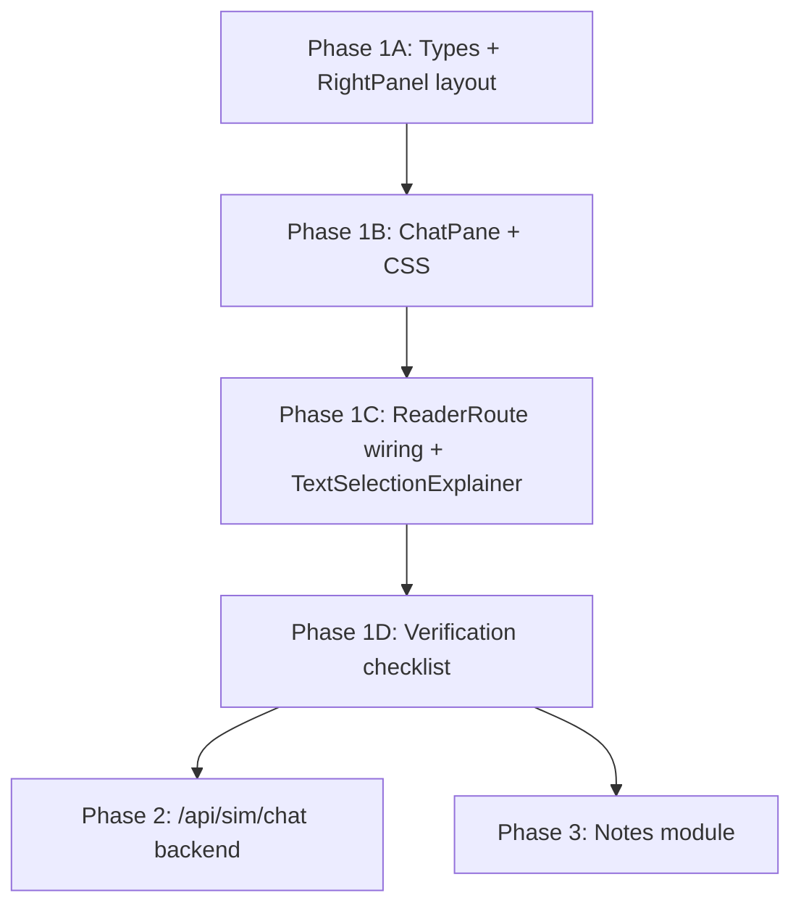

# AI Chat Module — Implementation Phases

This document breaks the [refined AI Chat plan](AI%20Chat%20Plan.md) into ordered phases with clear deliverables, dependencies, and exit criteria. Follow phases sequentially — each phase builds on the previous one.

**Related docs:** [AI Chat Plan.md](AI%20Chat%20Plan.md) · [note Plan.md](note%20Plan.md) (Notes tab, Phase 3)

---

## Overview

| Phase | Name | Scope | Backend changes |
|-------|------|-------|-----------------|
| **1A** | Foundation | Types + layout shell | None |
| **1B** | Chat UI | ChatPane component + CSS | None |
| **1C** | Wiring | ReaderRoute state, API handlers, selection rework | None |
| **1D** | Verification | Manual QA against checklist | None |
| **2** | Multi-turn chat API | True conversation history to LLM | New `/api/sim/chat` |
| **3** | Notes tab (separate) | NotebookPanel + Supabase | New `/api/sim/notes` |

Phases **1A–1D** ship a fully usable chat experience reusing existing endpoints. Phase **2** improves follow-up quality. Phase **3** is the separate Notes module — not required for chat to work.

---

## Phase 1A — Foundation

**Goal:** Establish shared types and the always-visible right panel shell so Chat has a home.

### Deliverables

- [x] `web/src/features/pdf-simulator/types/chat.ts`
  - `ChatMessageRole`, `RightTab`, `ChatMessage` (including `conceptTitle`, `selectedText`, `surroundingContext` for follow-ups)
- [x] `web/src/features/pdf-simulator/components/RightPanel.tsx`
  - Tab bar: Chat | Sim | Notes
  - Renders **only the active tab** (inactive tabs unmount)
  - Sim empty state when no annotation selected
  - Notes stub empty state ("coming soon")
- [x] `web/src/features/pdf-simulator/routes/ReaderRoute.tsx` (layout only)
  - Remove `hasActiveSim` gate on right panel
  - Default split: 60% PDF / 40% right panel
  - `SplitResizer` always visible
  - Wire `RightPanel` with placeholder content in each tab (can be `<div>Chat placeholder</div>` temporarily)

### Dependencies

- None (start here)

### Exit criteria

- Open a book → right panel is **always visible**
- Tab bar switches between Chat / Sim / Notes views
- Sim tab shows empty state when no sim selected
- Notes tab shows stub message
- PDF resizer works without a sim selected

### Files touched

| Action | File |
|--------|------|
| NEW | `types/chat.ts` |
| NEW | `components/RightPanel.tsx` |
| MODIFY | `routes/ReaderRoute.tsx` (layout only) |

---

## Phase 1B — Chat UI

**Goal:** Build the ChatPane presentation layer (no API wiring yet).

### Deliverables

- [x] `web/src/features/pdf-simulator/components/ChatPane.tsx`
  - Empty state ("Ask me anything about this PDF…")
  - `HighlightPill` for `role === 'system'`
  - `UserBubble` and `AiBubble` (plain text, `white-space: pre-wrap`)
  - Formula chips + takeaway bullets on AI messages
  - Loading skeleton (shimmer lines)
  - Error bubble (`isError`)
  - Input footer: textarea, Send, Clear
  - Enter → send, Shift+Enter → newline
  - Auto-scroll to bottom (suppress when user scrolled up)
- [x] `web/src/index.css` — chat + tab bar styles
  - `.right-panel`, `.right-panel__tab-bar`, `.right-panel__tab-btn`
  - `.chat-pane`, `.chat-messages-list`, `.chat-input-footer`
  - `.chat-bubble-user`, `.chat-bubble-ai`, `.chat-highlight-pill`, `.chat-input`
  - `@keyframes shimmer`
  - `.right-panel__empty-state`

### Dependencies

- Phase 1A (RightPanel renders Chat tab slot)

### Exit criteria

- Chat tab renders with mock messages passed as props (hardcode in ReaderRoute temporarily if needed)
- Empty state, loading shimmer, error state, and formula/takeaway chips all visually correct
- Clear button fires `onClear` callback
- Input disabled when `isLoading={true}`

### Files touched

| Action | File |
|--------|------|
| NEW | `components/ChatPane.tsx` |
| MODIFY | `index.css` |

---

## Phase 1C — Wiring

**Goal:** Connect chat to live APIs and rework PDF selection to inject into chat.

### Deliverables

- [x] `ReaderRoute.tsx` — full chat orchestration
  - State: `activeTab`, `chatMessages`, `isChatLoading`
  - `handleSendChatMessage(text)` with dual-route logic:
    - **First message / cleared thread** → `POST /api/sim/explain-selection`
    - **Follow-up** (last AI has `conceptTitle`) → `POST /api/sim/explain` with synthetic `SimSpec` + `customQuestion`
  - `handleInjectToChat(selectedText, page, context)` → explain-selection + highlight pill
  - `handleClearChat()` → reset messages
  - Track `loadingId` per request (replace by ID, not `isLoading` flag)
  - Error handling → inline ⚠️ on AI bubble
  - Tab auto-switch: Explain → chat, sim select → sim, Add Note → notes
- [x] `TextSelectionExplainer.tsx` — slim callback component (~100 lines)
  - Remove modal, fetch, follow-up thread
  - New props: `currentPage`, `onExplain`, `onAddNote?`
  - Floating buttons: `[ ✨ Explain ]` `[ 📓 Add Note ]`
  - Remove `if (isExplaining) return` guard in selection listener

### API routing reference

| User action | Endpoint | Notes |
|-------------|----------|-------|
| PDF highlight → Explain | `/api/sim/explain-selection` | `selectedText` = highlight, `surroundingContext` = page block |
| First typed question | `/api/sim/explain-selection` | `selectedText` = question, `surroundingContext` = book title |
| Follow-up question | `/api/sim/explain` | Synthetic spec from last AI message metadata |

### Helpers (co-locate in ReaderRoute or `utils/chatHelpers.ts`)

```typescript
formatSelectionReply(r)   // [summary, ...detailedExplanation].join('\n\n')
getLastAiMessage(msgs)    // last completed AI message for follow-up routing
```

### Dependencies

- Phase 1A (layout + RightPanel)
- Phase 1B (ChatPane UI)

### Exit criteria

- All Phase 1 verification items pass (see Phase 1D)
- No modal opens on PDF Explain
- Follow-up questions use tutor path, not re-explain-as-highlight

### Files touched

| Action | File |
|--------|------|
| MODIFY | `routes/ReaderRoute.tsx` (full wiring) |
| MODIFY | `components/TextSelectionExplainer.tsx` |

---

## Phase 1D — Verification

**Goal:** Confirm Phase 1 is stable before any backend work.

### Checklist

1. [x] Open book → right panel always visible, Chat tab active, empty state
2. [x] Type question → user bubble → shimmer → AI reply (summary + paragraphs)
3. [x] Type follow-up → AI reply via tutor path (not "highlighted text" framing)
4. [x] Select PDF text → `[Explain] [Add Note]` buttons appear
5. [x] Click Explain → Chat tab activates → highlight pill + AI reply (no modal)
6. [x] Click Add Note → Notes stub tab activates
7. [x] Select sim from drawer → Sim tab auto-activates, SimPanel renders
8. [x] Clear → thread resets to empty state
9. [x] Change page → chat history persists (session `useState`)
10. [x] Server unreachable → inline ⚠️ error on AI bubble, input re-enabled
11. [x] Rapid double-send → blocked while `isChatLoading`
12. [x] Long thread → auto-scroll unless user scrolled up

### Dependencies

- Phase 1C complete

### Exit criteria

- All 12 checklist items pass
- `npm run typecheck` passes in `web/`
- No console errors during normal chat flow

**Gate:** Do not start Phase 2 until this phase is signed off.

---

## Phase 2 — Multi-turn Chat API

**Goal:** Replace the dual-route frontend hack with a single backend endpoint that sends full conversation history to the LLM.

### Deliverables

- [x] `server/src/services/sim/explainService.ts`
  - `generateChatReply(messages[], bookContext)` — LLM cascade (OpenRouter → Groq → Gemini)
  - System prompt: tutor for `[bookTitle]`, concise answers
- [x] `server/src/routes/simulation.ts`
  - `POST /api/sim/chat` — body: `{ messages, bookContext }`, returns `{ reply, relatedFormulas? }`
- [x] `web/src/features/pdf-simulator/api.ts`
  - `simApiClient.sendChatMessage(...)`
- [x] `ReaderRoute.tsx`
  - Simplify `handleSendChatMessage` to always call `/api/sim/chat`
  - Map `chatMessages` → `{ role, content }[]` for the request
  - Keep `handleInjectToChat` on explain-selection OR migrate inject to chat endpoint

### Dependencies

- Phase 1D signed off

### Exit criteria

- Follow-up answers reference multiple prior turns correctly
- Single API call per user message (no synthetic SimSpec hack)
- Procedural fallback when no LLM keys configured
- Existing explain-selection still works for highlight-only use cases (if kept)

### Files touched

| Action | File |
|--------|------|
| NEW/MODIFY | `server/src/services/sim/explainService.ts` |
| MODIFY | `server/src/routes/simulation.ts` |
| MODIFY | `web/src/features/pdf-simulator/api.ts` |
| MODIFY | `web/src/features/pdf-simulator/routes/ReaderRoute.tsx` |

---

## Phase 3 — Notes Tab (Separate Module)

**Goal:** Replace Notes stub with full notebook feature. Defined in [note Plan.md](note%20Plan.md) — build after chat is stable.

### Deliverables

- [ ] `migrations/0002_notes.sql` — `sim_notes` table
- [ ] Backend CRUD: `GET/POST/PATCH/DELETE /api/sim/notes`
- [ ] `NotebookPanel.tsx` — note cards, inline edit, delete
- [ ] `TextSelectionExplainer` → `onAddNote` creates note + switches to Notes tab
- [ ] Replace Notes stub in `RightPanel`

### Dependencies

- Phase 1D (chat + selection buttons already wired)
- Supabase migration applied

### Exit criteria

- Highlight → Add Note → note appears in Notes tab
- Notes persist per book + anonymous `user_id` in localStorage
- Chat and Sim tabs unaffected

---

## Build Sequence Diagram



Phases 2 and 3 can run in parallel after 1D, but **Phase 2 is recommended first** (same feature area).

---

## Risk Mitigations (baked into phases)

| Risk | Mitigation | Phase |
|------|------------|-------|
| Chat has nowhere to render | Always-visible RightPanel in 1A | 1A |
| Stale closure on `chatMessages` | Use `loadingId` + functional updates | 1C |
| Weak follow-ups via explain-selection | Dual-route: `/explain` for follow-ups | 1C |
| Missing markdown library | Plain text + `pre-wrap` | 1B |
| Race on double-send | `isChatLoading` blocks input | 1C |
| Modal still opening | Strip TextSelectionExplainer in 1C | 1C |

---

## Quick Reference — Files by Phase

```
Phase 1A
  + types/chat.ts
  + components/RightPanel.tsx
  ~ routes/ReaderRoute.tsx

Phase 1B
  + components/ChatPane.tsx
  ~ index.css

Phase 1C
  ~ routes/ReaderRoute.tsx
  ~ components/TextSelectionExplainer.tsx

Phase 2
  ~ server/src/services/sim/explainService.ts
  ~ server/src/routes/simulation.ts
  ~ web/src/features/pdf-simulator/api.ts
  ~ routes/ReaderRoute.tsx

Phase 3
  + migrations/0002_notes.sql
  + components/NotebookPanel.tsx
  ~ server (notes CRUD)
  ~ RightPanel.tsx
```
